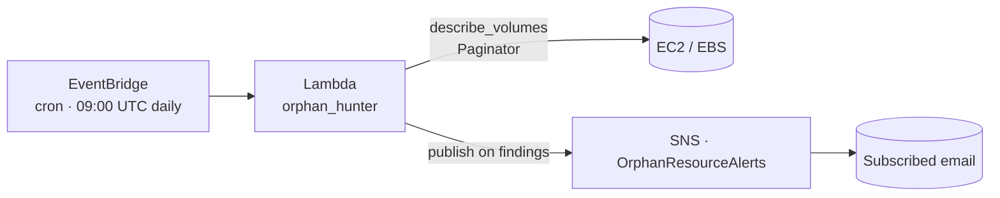

# AWS Orphan Resource Hunter

[](https://github.com/emredogan-cloud/aws-cost-optimization-ebs/actions/workflows/main.yaml)

Serverless FinOps job that scans the active region every morning for **detached ("available") EBS volumes** — the largest predictable source of unattended AWS cost — and emails the on-call inbox a notification when any are found.

Deployed as a single AWS SAM stack: Lambda + EventBridge schedule + SNS email topic. Read-only by design; the function never deletes resources.



---

## What it does

- Schedules a daily `cron(0 9 * * ? *)` execution via EventBridge.
- The Lambda walks `ec2.describe_volumes` with a `boto3` paginator filtering for `state=available`.
- For each orphan it captures `VolumeId`, size, type, and tags.
- If the result set is non-empty, the function publishes a structured message to the SNS topic, which fans out to the subscribed email address.

The function does not call any mutating EC2 API. It is safe to deploy in production accounts and observe before adopting a remediation step.

---

## Repository Layout

```
aws-cost-optimization-ebs/
├── template.yaml             # SAM stack: Lambda + Schedule + SNS
├── src/
│   ├── app.py                # lambda_handler
│   └── requirements.txt
├── utils/
│   ├── logging.py
│   └── session.py
└── LICENSE
```

---

## Stack

| Component | Detail |
|---|---|
| Runtime | Python 3.12, 128 MB, 10 s timeout |
| Trigger | EventBridge `cron(0 9 * * ? *)` — daily 09:00 UTC |
| Permissions | `AmazonEC2ReadOnlyAccess` + scoped `sns:Publish` to the topic created by the stack |
| Notification | SNS topic `OrphanResourceAlerts` with email subscription parametrized by `NotificationEmail` |
| Logging | CloudWatch Logs, JSON `LogFormat` |
| IaC | AWS SAM (`AWS::Serverless::Function`) |

---

## Deploy

Prerequisites: AWS CLI, [SAM CLI](https://docs.aws.amazon.com/serverless-application-model/latest/developerguide/install-sam-cli.html), Python 3.12.

```bash
sam build
sam deploy --guided
```

Guided deploy prompts:

- **Stack Name** — e.g. `aws-orphan-hunter`
- **AWS Region** — target region
- **NotificationEmail** — address that should receive alerts (SNS sends a confirmation email)
- **Confirm changes before deploy** — `y`
- **Allow SAM CLI IAM role creation** — `y`

The subscription email must be confirmed by clicking the verification link before the first scan can deliver.

### Subsequent deploys

```bash
sam build && sam deploy
```

### Tear down

```bash
sam delete --stack-name <stack-name>
```

---

## Operational Notes

- Idempotent on re-deploy. The SNS topic name is fixed, so do not deploy twice in the same region without renaming.
- The function uses paginators; thousands of volumes per region are handled without modification.
- Future remediation paths (out of scope for this stack): tag-driven auto-delete, snapshot-then-delete with grace period, Cost Explorer cross-reference, multi-region fan-out.

---

## License

[MIT](LICENSE)
